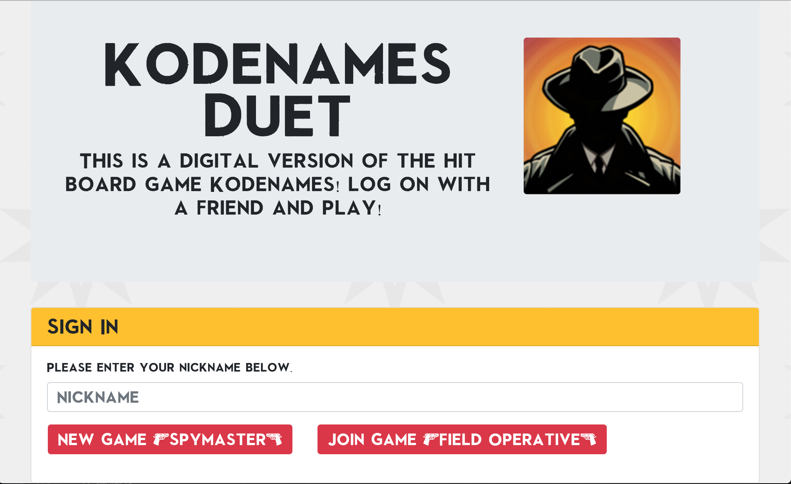
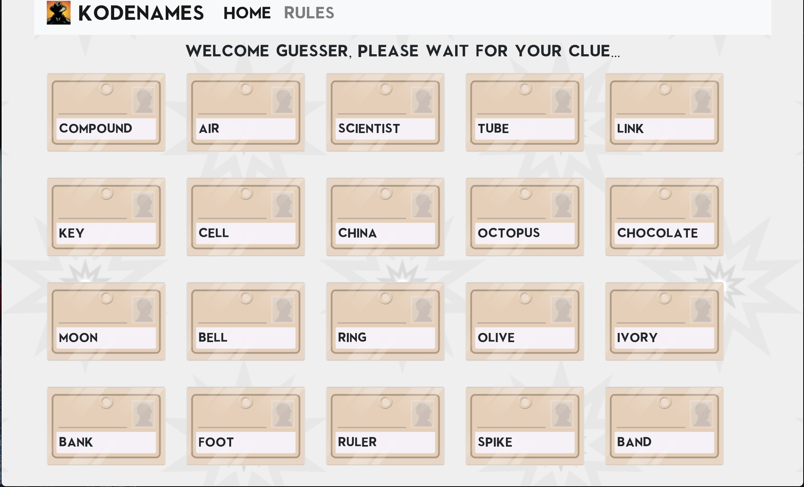
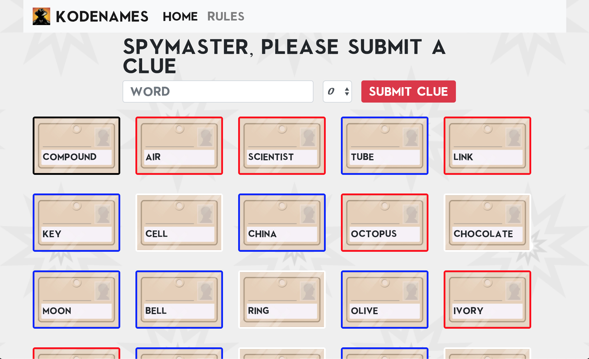

# KODENAMES DUET 

<h3>Welcome to Kodesnames Duet! This is a two player digital version of the hit board game Kodenames.</h3>

<h4>Technologies Used</h4>

<h5>Front-End</h5>

Built using Bootstrap, Javascript, jQuery, and  jQuery flip plugin animation. 

<h5>Back-End</h5>

We created our database in MySQL and use Sequelize ORM for modeling.
The two person sessions are created using socket.io. 

<h5>Technologies you will need to use our repository:</h5>

1. Bootstrap or another front-end tech of your choice. 

2. My SQL work-bench or another SQL compatible desktop client or command line tool. 

3. The following NPM packages: 

    * dotenv
    * eslint (or another code formatter)
    * express
    * mysql
    * mysql2
    * sequelize
    * socket.io 
    * socket-io.client
    * socket.io-sequelize

<h5>Screenshots and Demo of Kodenames Digital</h5>

</img>

</img>

</img>

</img>

Video Demo of Code Names Duet the original board game: 
(we have nothing to do with this video or its content)

https://www.youtube.com/watch?v=C8NKRosF6Vo

